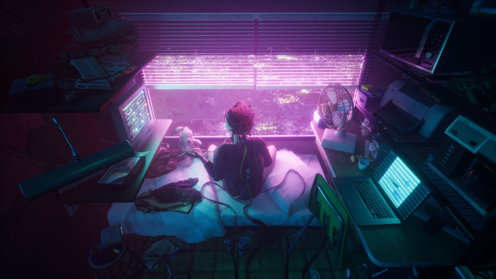
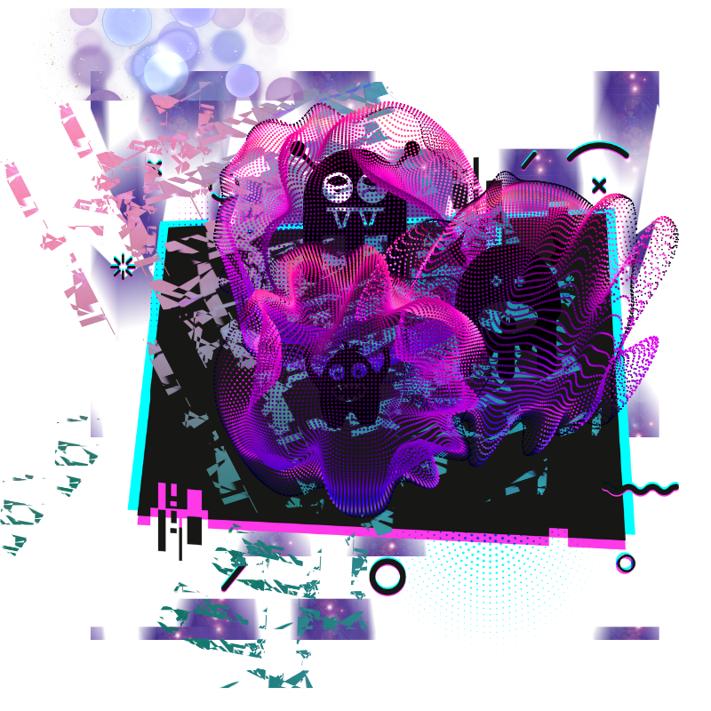

  

Hi! 👋 I'm **`Christine`**!

I'm an fresh *full-stack web developer* with a passion for creating and designing 🧚

**Welcome to my [vanilla portfolio](https://christiecamp.github.io/vanilla-land/)** 👾

#

#

